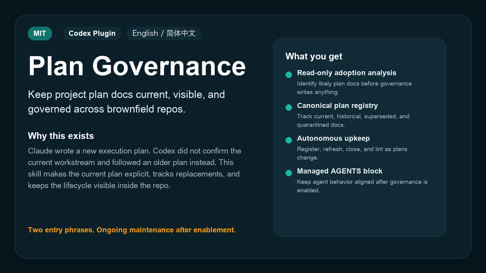
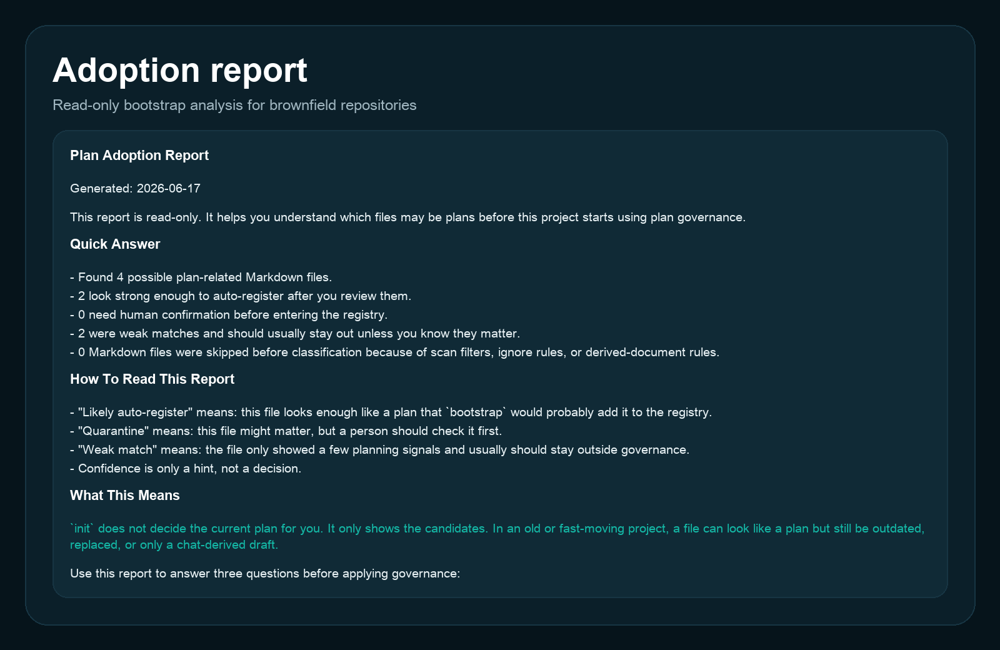
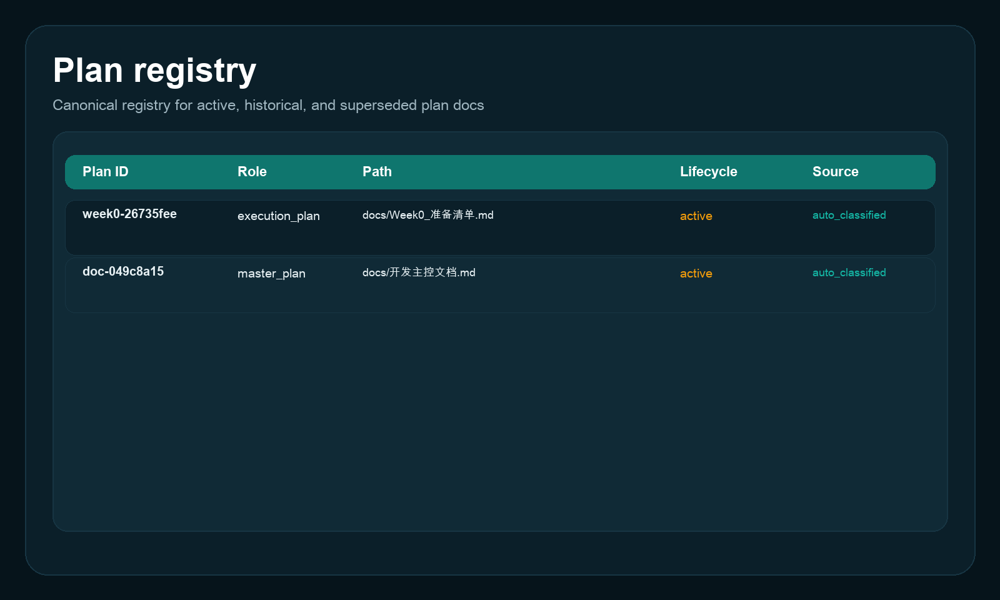
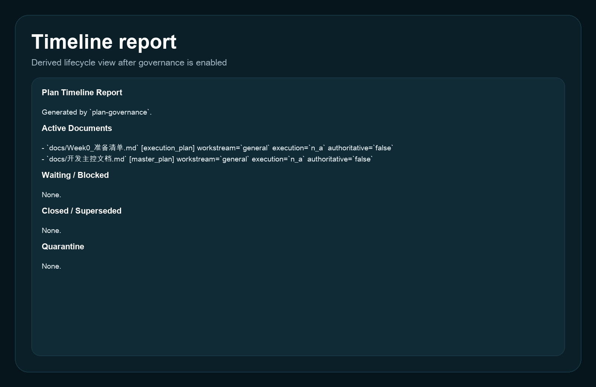

<p align="center">
  
</p>

<h1 align="center">Plan Governance</h1>

<p align="center">
  <strong>Keep project plan docs current, visible, and governed across brownfield repos.</strong>
</p>

<p align="center">
  <a href="./README.zh-CN.md">简体中文</a> ·
  <a href="#30-second-start">30-second start</a> ·
  <a href="#real-output">Real output</a>
</p>

<p align="center">
  <a href="./LICENSE"></a>
  
  
</p>

<p align="center">
  
</p>

## Why This Exists

Claude wrote a new production plan. Codex later entered the same project, did not confirm the current workstream, and treated an older plan as the active source of truth.

That failure mode is common in real repositories: plans are created by different agents, old documents stay around, and the project depends on chat history to remember what is current.

`plan-governance` turns that implicit memory into repo-visible state. It does not write your product roadmap for you. It governs the lifecycle of plan documents: adoption analysis, registry, replacement links, closeout, and ongoing maintenance after enablement.

## What It Solves

| Problem | What plan-governance does |
|---|---|
| Multiple docs look like "the current plan" | Creates a canonical `docs/plan_registry.md` with lifecycle and authority fields |
| A new plan replaces an old one, but nobody records the relationship | Tracks `supersedes` / `superseded_by` links |
| Brownfield repos already have many old docs | Starts with read-only adoption analysis before writing governance files |
| Agents keep relying on chat context | Installs a managed `AGENTS.md` block after governance is enabled |
| Users do not want to remember many maintenance commands | Keeps registry, reports, closeout, and linting proactive after enablement |

## 30-Second Start

### Install

In Codex, install from this GitHub repo with `$skill-installer`:

```text
Use $skill-installer to install cici-uu8/Plan-governance-Skill from GitHub.
```

Restart Codex if the new skill does not appear immediately.

### Use

After installation, use only these two entry phrases:

```text
Use $plan-governance to analyze adoption for this repo.
Use $plan-governance to enable plan governance.
```

| Phrase | Meaning |
|---|---|
| `Use $plan-governance to analyze adoption for this repo.` | Read-only scan. It writes an adoption report, but does not create a registry or modify `AGENTS.md`. |
| `Use $plan-governance to enable plan governance.` | Creates governance files and installs the managed `AGENTS.md` block unless you explicitly refuse. |

## What Happens After Enablement

Once `docs/plan_registry.md` exists, the repo is considered governed.

| Event | Default behavior |
|---|---|
| A new plan document appears | Register it or refresh governance state |
| A new plan replaces an older one | Add supersession links and mark the old plan superseded |
| A plan ends without replacement | Close it instead of editing historical text |
| Governance state changes | Refresh timeline output and run lint |
| Multiple docs could be current | Ask before deciding |
| A document could be either replacement or parallel workstream | Ask before linking it |

The intended UX is not "make the user run eight commands." The intended UX is: the user opts in, then agents maintain the plan lifecycle as part of normal project work.

## Real Output

### Read-only adoption report

`init` produces a readable report before the repo is governed. It helps a human decide which legacy files are current, historical, weak matches, or candidates for quarantine.

<p align="center">
  
</p>

### Canonical registry

After enablement, the registry becomes the visible source of truth for plan lifecycle state.

<p align="center">
  
</p>

### Timeline view

The timeline report is derived from the registry, so humans and agents can quickly see active, blocked, closed, superseded, and quarantined documents.

<p align="center">
  
</p>

Sample Markdown outputs are available in [`examples/`](./examples/).

## Boundaries And Exit

Plan governance should not be forced into every repo.

Use it when the repo has project-level planning documents, multiple active or historical plans, or agents that need a stable source of truth for plan lifecycle.

Do not force it when the repo only has scratch notes, chat transcripts, or no project-level plan documents.

To stop the managed `AGENTS.md` rule injection while keeping governance history:

```bash
python3 ~/.codex/skills/plan-governance/scripts/plan_governance.py remove-agents-block --repo-root "$(pwd)"
```

This removes only the managed block. It does not delete the registry, reports, or config files, because those files may contain project history.

## Host Compatibility

This project is built first for Codex skills and Codex plugin distribution.

| Host | Status | Notes |
|---|---|---|
| Codex | Supported | Uses `SKILL.md`, local scripts, `AGENTS.md`, and `.codex-plugin/plugin.json` |
| Codex-compatible skill hosts | Possible | Requires support for skill invocation and local script execution |
| Claude Code or other agent hosts | Needs adaptation | Do not assume `$plan-governance`, `AGENTS.md`, or plugin metadata work without an adapter |

## Repository Layout

```text
plan-governance/
├── .codex-plugin/plugin.json
├── README.md
├── README.zh-CN.md
├── SKILL.md
├── agents/openai.yaml
├── assets/
├── examples/
├── references/
├── scripts/
├── skills/plan-governance/SKILL.md
└── templates/
```

`README.md` is the public project entry. `SKILL.md` is the agent execution guide. The nested `skills/plan-governance/SKILL.md` is the plugin distribution wrapper.

## Star History

This repository is new. The chart below will become meaningful after the project has public usage.

<picture>
  <source media="(prefers-color-scheme: dark)" srcset="https://api.star-history.com/svg?repos=cici-uu8/Plan-governance-Skill&type=Date&theme=dark" />
  <source media="(prefers-color-scheme: light)" srcset="https://api.star-history.com/svg?repos=cici-uu8/Plan-governance-Skill&type=Date" />
  
</picture>

## License And Contributing

This project is released under the [MIT License](./LICENSE).

Contributions are welcome after the public API and distribution path settle. Until then, issues and PRs should focus on:

- host compatibility problems
- plan classification false positives or false negatives
- lifecycle governance edge cases
- README, examples, and installation clarity
